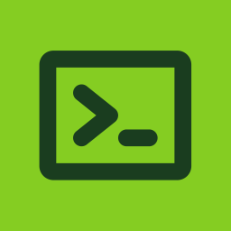

<p align="center">
  
</p>

<h1 align="center">InstallKit</h1>

<p align="center">
  <strong>Set up your new Mac in minutes, not hours.</strong>
</p>

<p align="center">
  <a href="https://installkit.vercel.app">Visit InstallKit</a>
</p>

<p align="center">
  
</p>

---

## 🤔 What is InstallKit?

**InstallKit** helps you install all your favorite Mac apps at once using [Homebrew](https://brew.sh).

Instead of:
1. Searching for each app online
2. Downloading installers one by one
3. Dragging apps to your Applications folder repeatedly

You can:
1. Pick all the apps you want from InstallKit
2. Copy one command
3. Paste it in Terminal and let Homebrew install everything

Perfect for:
- **Setting up a new Mac** — Get all your apps installed quickly
- **Reinstalling macOS** — Restore your setup without hunting for downloads
- **Sharing your setup** — Send friends a link with your recommended apps

## 🚀 How to Use

### Option 1: Browse and Select Apps

1. Go to [installkit.vercel.app](https://installkit.vercel.app)
2. Browse through 200+ popular Mac apps organized by category
3. Check the apps you want to install
4. Copy the generated Homebrew command
5. Paste it in your Terminal

### Option 2: Share Your Existing Setup

Already have a Mac with apps installed via Homebrew? Generate a shareable link with all your apps:

```bash
curl -fsSL installkit.vercel.app/s | bash
```

This scans your installed Homebrew packages and creates a personalized InstallKit link. Use it to:
- **Back up your app list** — Save the link before wiping your Mac
- **Share with others** — Send the link to friends so they can install the same apps
- **Set up another Mac** — Open the link on your new machine and install everything in one go

## 📋 Requirements

You need [Homebrew](https://brew.sh) installed on your Mac. If you don't have it yet:

```bash
/bin/bash -c "$(curl -fsSL https://raw.githubusercontent.com/Homebrew/install/HEAD/install.sh)"
```

## ✨ Features

- **200+ Curated Apps** — Popular browsers, dev tools, productivity apps, media players, and more
- **Search** — Quickly find any app by name
- **Homebrew Search** — Can't find an app? Search Homebrew's full catalog of 10,000+ packages
- **Categories** — Browse by type: Browsers, Development, Productivity, Entertainment, etc.
- **Dark Mode** — Easy on the eyes
- **Shareable Links** — Share your app selections with anyone

---

## 🛠️ For Developers

### Tech Stack

- [Next.js 15](https://nextjs.org/) with App Router
- [React 19](https://react.dev/)
- [TypeScript](https://www.typescriptlang.org/)
- [Tailwind CSS 4](https://tailwindcss.com/)
- [shadcn/ui](https://ui.shadcn.com/)
- [TanStack Query](https://tanstack.com/query)

### Local Development

```bash
# Clone the repo
git clone https://github.com/Royal-lobster/installkit.git
cd installkit

# Install dependencies
pnpm install

# Start dev server
pnpm dev
```

Open [http://localhost:3000](http://localhost:3000) in your browser.

### Adding New Apps

See [CONTRIBUTING.md](./CONTRIBUTING.md) for details. Quick example:

```typescript
// lib/data/apps.ts
{
  id: 'my-app',
  name: 'My App',
  brewName: 'my-app',
  category: AppCategoryEnum.enum.productivity,
  description: 'Short description',
  iconUrl: simpleIcon('myapp'),
  isCask: true,
}
```

### Scripts

```bash
pnpm dev      # Start development server
pnpm build    # Build for production
pnpm lint     # Run linter
pnpm format   # Format code
```

## 🤝 Contributing

Contributions welcome! See [CONTRIBUTING.md](./CONTRIBUTING.md) for guidelines.

## 📝 License

MIT License — see [LICENSE](./LICENSE) for details.

## 🙏 Acknowledgments

- [Homebrew](https://brew.sh/) for making Mac package management easy
- [shadcn/ui](https://ui.shadcn.com/) for beautiful components
- [Simple Icons](https://simpleicons.org/) for brand icons

---

<p align="center">
  Built by <a href="https://github.com/Royal-lobster">Srujan</a>
</p>
